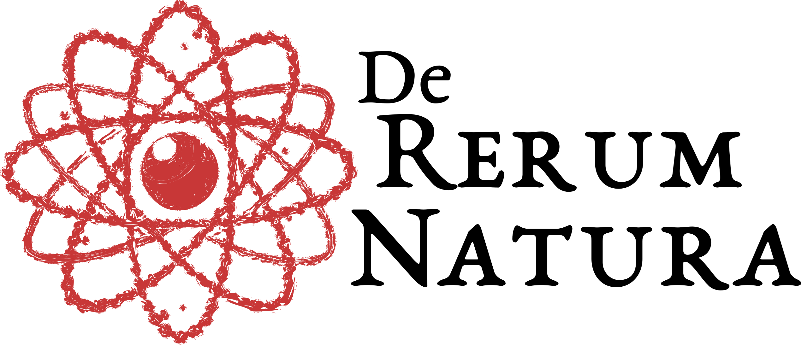

## {.center background-color="white"}

<!-- {width=2in} -->

<!--  -->

#
 
 

::: columns 
::: {.column .right width="60%"}
[**The Materials Modeling Landscape**]{style="color:teal"} 
[*(An introduction for Graduate Students)*]{style="color:gray"}

:::
:::{.column .right width="5%"}
::: {data-id="box1" style="background: #bcd6d6; width: 15px; height: 135px; border-radius: 0px; align: right; margin: 0em 0em 0em 1.1em;"}
:::
:::
::: {.column .left width="35%"}
::::{.ddm style="margin:0"}
:::{.dd-head onclick="toggleBox(this)" style="color:black; background:white;"}
[Sheharyar Pervez]{style="font-size:1.2em"} 
[DRN Group, GIK Institute]{style="color:gray; font-size:1em; font-style: normal;"}

:::
<!-- :::{.dd-box style="background:LightCoral; color:black"} -->
<!-- [(She.HER.yar)]{style="font-size:0.7em"}

[She = **She**ll; har = **Her**;]{style="font-size:0.7em"} \
[yar = **yar**n]{style="font-size:0.7em"} \
[But feel free to say it anyway you like.]{style="font-size:0.7em"} -->
<!-- ::: -->
::::

:::
:::

